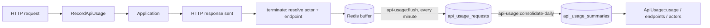

# Laravel API Usage

[](https://github.com/systemverk/laravel-api-usage/actions/workflows/ci.yml)
[](https://packagist.org/packages/systemverk/laravel-api-usage)
[](LICENSE)

**Self-hosted, actor-aware API usage analytics for Laravel.**

Track who uses your API, which endpoints they use, how much they use them, and
how they perform — without an external observability platform.

```php
ApiUsage::usage()
    ->thisMonth()
    ->forActor(UsageActor::organization(42))
    ->summary();
```

```php
$summary->totalRequests;      // 18420
$summary->serverErrors;       // 3
$summary->averageDurationMs;  // 46.7
$summary->errorRate();        // 0.0121
```

## What problem does this solve?

Most Laravel applications can tell you *that* their API is busy. Far fewer can
answer "how much did this customer use us last month", "which endpoint is
getting slower", or "which API key is generating all the 422s" — the questions
that show up in support threads, capacity planning and invoicing.

This package answers them from your own database. Every request is buffered in
Redis **after** the response has been sent, flushed to SQL in batches by a
scheduled command, and rolled up into per-actor, per-endpoint daily and monthly
summaries you query through a small PHP API.

### When should I use this?

| You need | Reach for |
|---|---|
| Distributed tracing across services | OpenTelemetry |
| Debugging individual requests in development | Telescope, a request logger |
| Error tracking and alerting | Sentry, Bugsnag |
| **API usage analytics per customer, tenant or API key** | **This package** |

These are different jobs, not competitors. This package deliberately does *not*
ship a dashboard, enforce quotas, trace across services, or record request
bodies. See [Out of scope](#what-this-package-deliberately-does-not-do).

## Requirements

| | Supported |
|---|---|
| PHP | 8.2, 8.3, 8.4, 8.5 |
| Laravel | 12.x, 13.x |
| Redis client | `ext-redis` (recommended) or `predis/predis` |
| Database | MySQL, MariaDB, PostgreSQL, SQLite, SQL Server |

## Quick Start

### 1. Install

```bash
composer require systemverk/laravel-api-usage
```

### 2. Run migrations

```bash
php artisan migrate
```

The package ships its migrations and loads them automatically — there is nothing
to publish. Two tables are created:

- `api_usage_requests` — one row per recorded request
- `api_usage_summaries` — daily and monthly aggregates

### 3. Make sure Redis is configured

Requests are appended to a Redis list before being flushed to SQL.

- A connection must exist under `database.redis` (or `database.redis.clusters`)
- The package uses the `default` connection unless told otherwise
- Override with `API_USAGE_REDIS_CONNECTION`

If the configured connection does not exist, the middleware records nothing
rather than throwing — usage tracking never takes an application down.

### 4. Run the scheduler

The commands are registered on the scheduler automatically, but they only run if
your scheduler runs.

```cron
* * * * * php /path/to/app/artisan schedule:run >> /dev/null 2>&1
```

### 5. Check that it is working

```bash
php artisan api-usage:status
```

## Architecture



The important property is where the line falls: **nothing between the request
arriving and the response leaving touches SQL.** Actor resolution, endpoint
resolution, serialization and the two Redis round trips all happen in
`terminate()`, after the client already has its response.

Failure is handled the same way at every step. A minute buffer is claimed with
`RENAMENX` into a private processing key, tracked in a Redis set, and only
deleted once the database write is confirmed — so a crashed or failed flush is
retried on the next run instead of silently losing entries. See
[What can be lost](#what-can-be-lost).

## Terminology

### Actor

An entity usage is attributed to. The package never assumes it is a `User`:

`user:42` · `organization:12` · `tenant:acme` · `api_key:abc123` ·
`service_account:billing` · `guest`

An actor has a **type** and an **id**, both stored as first-class columns, plus
an `actor_key` (`type:id`) for convenient grouping. Ids are normalized to
strings, so integer and UUID keys behave identically.

### Credential

*Which key* the actor used — a personal access token, an API key, an OAuth
client. This is a second dimension, orthogonal to the actor: it lets you keep
"the Acme team" as the actor while still breaking usage down per token.

### Endpoint

The logical Laravel endpoint, not the concrete URL. The endpoint key prefers
`GET:api.orders.show` over `GET:/api/orders/123`, so resource ids never
fragment your analytics. The raw path is still stored on each row for debugging.

## Actor Tracking

Out of the box, usage is attributed to the authenticated user, and to `guest`
when there is none. That is one class:

```php
use Systemverk\LaravelApiUsage\Actors\AuthenticatedUserActorResolver;
```

Because Sanctum lets any model be tokenable, this already gives you team- or
organization-level attribution when your tokens belong to a `Team`.

### Custom actor resolver

Anything else is a resolver of your own:

```php
use Illuminate\Http\Request;
use Systemverk\LaravelApiUsage\Actors\UsageActor;
use Systemverk\LaravelApiUsage\Contracts\ResolvesUsageActor;

final class OrganizationActorResolver implements ResolvesUsageActor
{
    public function resolve(Request $request): ?UsageActor
    {
        $organizationId = $request->user()?->organization_id;

        if (! $organizationId) {
            return UsageActor::guest();
        }

        return UsageActor::make('organization', $organizationId);
    }
}
```

```php
// config/api_usage.php
'actor' => [
    'resolver' => OrganizationActorResolver::class,
],
```

Resolvers are built through the container, so constructor injection works.
Returning `null` means **do not record this request at all** — that is how
`track_guests` drops anonymous traffic.

### Per-credential attribution

`credential_id` is filled by a callback you register. The package never guesses:

```php
// app/Providers/AppServiceProvider.php
use Illuminate\Http\Request;
use Systemverk\LaravelApiUsage\Support\UsageRecorder;

public function boot(): void
{
    UsageRecorder::resolveCredentialUsing(
        fn (Request $request) => $request->user()?->currentAccessToken()?->getKey()
    );
}
```

The same closure can live in `actor.credential_resolver` in the config file
instead, at the cost of making the config uncacheable. A resolver registered in
code wins.

```php
// Everything one team did this month, across all of its keys
ApiUsage::usage()->thisMonth()->forActor(UsageActor::make('team', $team->id))->summary();

// Just one key
ApiUsage::usage()->thisMonth()->forCredential($token->id)->summary();
```

## Endpoint Tracking

`RouteEndpointResolver` is the default and needs no configuration. For unusual
routing setups, implement `ResolvesUsageEndpoint` and point
`endpoint.resolver` at it. Unlike actor resolution it never returns null: a
request that matched no route is still recorded, keyed by its path.

## Querying

Three entry points, all sharing the same period selection and filters.

### Periods

`today()` · `yesterday()` · `thisWeek()` · `lastDays(int $days)` ·
`thisMonth()` · `lastMonth()` · `between(DateTimeInterface $from, DateTimeInterface $to)`

All dates are UTC and both ends of a range are inclusive. Without a period, a
query covers the current month.

### Filters

`forActor(UsageActor $actor)` · `forActorType(string $type)` ·
`forCredential(string|int $id)` · `forEndpoint(string $endpointKey)`

Queries are immutable, so a partially built query is safe to reuse:

```php
$thisMonth = ApiUsage::usage()->thisMonth();

$acme = $thisMonth->forActor(UsageActor::organization(1))->summary();
$globex = $thisMonth->forActor(UsageActor::organization(2))->summary();
```

### Usage totals

```php
ApiUsage::usage()->lastDays(7)->summary();  // UsageSummary
ApiUsage::usage()->thisMonth()->count();    // int
```

`UsageSummary` exposes `totalRequests`, `informational`, `successfulRequests`,
`redirects`, `clientErrors`, `serverErrors`, `totalDurationMs`,
`averageDurationMs`, `minDurationMs`, `maxDurationMs`, plus `errorRate()`,
`serverErrorRate()`, `hasUsage()` and `toArray()`. An empty period returns zero
counts and `null` durations — never a misleading zero-millisecond average.

### Endpoint analytics

```php
ApiUsage::endpoints()->thisMonth()->mostUsed();      // Collection<EndpointUsage>
ApiUsage::endpoints()->thisMonth()->slowest(5);
ApiUsage::endpoints()->thisMonth()->mostErrors();
ApiUsage::endpoints()->thisMonth()->all();
```

Each `EndpointUsage` carries `endpointKey`, `method`, `routeName`, `routeUri`
and a full `UsageSummary`. Ordering ties break on the endpoint key, so results
are stable between runs.

### Actor analytics

```php
ApiUsage::actors()->lastDays(30)->mostActive();
ApiUsage::actors()->lastDays(30)->mostErrors();
ApiUsage::actors()->lastDays(30)->forActorType('organization')->mostActive();
```

Each `ActorUsage` carries `actorType`, `actorId`, `actorKey`, a `UsageSummary`,
and `actor()` to turn the result back into a `UsageActor` you can feed into
another query. Different actor types never collide: `user:42` and
`organization:42` are separate rows.

### Query freshness

The query API reads **daily summaries**, not raw rows. Summaries are small,
outlive raw retention, and already carry duration totals. The cost is
freshness: numbers are as current as the last consolidation run.

By default the package re-consolidates the current day **every hour**, so
`today()` is at most an hour behind. Consolidation is idempotent — a rerun
recomputes the day rather than double-counting it — so you can run it as often
as you like:

```bash
php artisan api-usage:consolidate-daily --today
```

Turn the hourly run off with `API_USAGE_SCHEDULE_CONSOLIDATE_TODAY=false` on
very high-volume installations, and accept that today's usage appears after the
nightly run.

### Raw access

Both Eloquent models are public API, and are the right tool for questions the
query services do not cover:

```php
use Systemverk\LaravelApiUsage\Models\ApiUsageRequest;
use Systemverk\LaravelApiUsage\Models\ApiUsageSummary;

// Slowest concrete paths in the last 24 hours
ApiUsageRequest::query()
    ->where('requested_at', '>=', now()->utc()->subDay())
    ->selectRaw('path, count(*) as hits, avg(duration_ms) as avg_ms')
    ->groupBy('path')
    ->orderByDesc('avg_ms')
    ->limit(10)
    ->get();

// Server errors today
ApiUsageRequest::query()->statusClass(5)->whereDate('requested_at', today())->count();

// Monthly rollups for one actor
ApiUsageSummary::query()->monthly()->forActor(UsageActor::organization(42))->get();
```

Treat them as the advanced API. The query services are the stable surface; the
schema may change in a future major version.

## What Runs Automatically

| Command | Frequency | Purpose |
|---|---|---|
| `api-usage:flush --max-minutes=5` | every minute | Redis buffer → `api_usage_requests` |
| `api-usage:consolidate-daily --today` | hourly | Keeps today's summaries fresh |
| `api-usage:consolidate-daily` | daily at 02:00 | Yesterday's raw rows → daily summaries |
| `api-usage:consolidate-monthly` | monthly on day 1 at 03:00 | Daily → monthly summaries |
| `api-usage:prune` | daily at 03:10 | Applies the retention windows |

Plus `api-usage:status`, which is never scheduled: it reads the enabled state,
Redis and database connectivity, buffer depth, sampling rate and retention
windows, and mutates nothing.

`RecordApiUsage` is appended to the `api` middleware group. If that group does
not exist, registration is skipped silently.

## Configuration

Defaults are usable as-is. Publish the config only if you need to change them:

```bash
php artisan vendor:publish --tag=api-usage-config
```

| Key | Env | Default | Description |
|---|---|---|---|
| `enabled` | `API_USAGE_ENABLED` | `true` | Master on/off switch |
| `actor.resolver` | — | `AuthenticatedUserActorResolver` | Class deciding who a request belongs to |
| `actor.track_guests` | `API_USAGE_TRACK_GUESTS` | `true` | Record unauthenticated traffic |
| `actor.credential_resolver` | — | `null` | Callback resolving the credential used |
| `endpoint.resolver` | — | `RouteEndpointResolver` | Class deciding the endpoint identity |
| `buffer.connection` | `API_USAGE_REDIS_CONNECTION` | `default` | Redis connection name |
| `buffer.key_prefix` | `API_USAGE_REDIS_KEY_PREFIX` | `api_usage:` | Redis key prefix |
| `buffer.ttl_seconds` | `API_USAGE_REDIS_TTL_SECONDS` | `7200` | Buffer key TTL (min 60) |
| `buffer.flush_batch_size` | `API_USAGE_FLUSH_BATCH_SIZE` | `1000` | Rows per insert statement |
| `database.connection` | `API_USAGE_DB_CONNECTION` | `null` | Dedicated connection, or the app default |
| `database.tables.requests` | `API_USAGE_TABLE_REQUESTS` | `api_usage_requests` | Raw table name |
| `database.tables.summaries` | `API_USAGE_TABLE_SUMMARIES` | `api_usage_summaries` | Aggregate table name |
| `database.consolidation_chunk_size` | `API_USAGE_CONSOLIDATION_CHUNK_SIZE` | `2000` | Read chunk size during rollup |
| `sampling.rate` | `API_USAGE_SAMPLING_RATE` | `1.0` | Fraction of requests recorded |
| `except` | — | `['up', 'health']` | Paths never recorded (supports `*`) |
| `privacy.hash_ips` | `API_USAGE_HASH_IPS` | `true` | Store a salted hash, or nothing at all |
| `privacy.ip_hash_salt` | `API_USAGE_IP_HASH_SALT` | `null` | Defaults to `app.key` |
| `privacy.record_user_agent` | `API_USAGE_RECORD_USER_AGENT` | `true` | Store the user agent string |
| `privacy.request_id_headers` | — | `X-Request-Id`, `X-Correlation-Id` | Correlation headers, in priority order |
| `retention.raw_days` | `API_USAGE_RETENTION_RAW_DAYS` | `30` | Raw row retention |
| `retention.daily_days` | `API_USAGE_RETENTION_DAILY_DAYS` | `730` | Daily summary retention (0 = forever) |
| `retention.monthly_months` | `API_USAGE_RETENTION_MONTHLY_MONTHS` | `0` | Monthly summary retention (0 = forever) |
| `middleware.auto_register` | `API_USAGE_AUTO_MIDDLEWARE` | `true` | Auto-append the middleware |
| `middleware.group` | `API_USAGE_MIDDLEWARE_GROUP` | `api` | Group to append the middleware to |
| `schedule.enabled` | `API_USAGE_SCHEDULE_ENABLED` | `true` | Auto-register scheduled commands |
| `schedule.flush_minutes` | `API_USAGE_SCHEDULE_FLUSH_MINUTES` | `5` | `--max-minutes` used by flush |
| `schedule.consolidate_today` | `API_USAGE_SCHEDULE_CONSOLIDATE_TODAY` | `true` | Hourly refresh of today |
| `schedule.daily_at` | `API_USAGE_SCHEDULE_DAILY_AT` | `02:00` | Daily consolidation time |
| `schedule.monthly_at` | `API_USAGE_SCHEDULE_MONTHLY_AT` | `03:00` | Monthly consolidation time |
| `schedule.prune_at` | `API_USAGE_SCHEDULE_PRUNE_AT` | `03:10` | Prune time |

### Excluding noisy endpoints

```php
'except' => ['up', 'health', 'webhooks/*'],
```

### Sampling

```php
'sampling' => ['rate' => 0.1], // record roughly one request in ten
```

Counts are **never** scaled back up. At a rate below 1.0 the package reports
what it observed, not an estimate of the true total, because a number labelled
"total requests" that is silently extrapolated is worse than an honest sample.
Keep the rate at 1.0 if the counts must be exact — for billing, say.

## Retention

| Data | Default | Why |
|---|---|---|
| Raw rows | 30 days | Detailed, grows fastest, only needed for recent debugging |
| Daily summaries | 730 days | Small, and what the query API reads |
| Monthly summaries | forever | Tiny, and the basis for year-over-year comparisons |

`api-usage:prune` applies all three, deletes in chunks so a large backlog never
holds one long transaction open, and is safe to run repeatedly. Set a summary
retention to `0` to keep it indefinitely.

Note that consolidation recomputes a day from raw rows, so re-running
`consolidate-daily` for a date whose raw rows have been pruned will zero that
day's summaries. Backfill before you prune, not after.

## Privacy

What is stored:

- Timestamp, actor type/id, credential id, HTTP method, route name, route URI,
  concrete path, endpoint key, status code, duration
- A salted SHA-256 digest of the IP address, or nothing when `hash_ips` is off
- The user agent string, unless `record_user_agent` is off
- One correlation id, from the headers you list

What is never stored:

- Request bodies · response bodies · query-string values · cookies ·
  `Authorization` headers · any header other than the configured correlation id
- Actor **labels**. `UsageActor` accepts a human-readable label for your own use
  in query results, and it is deliberately dropped before serialization, so a
  customer name cannot leak into the usage tables by accident.

Two things to be aware of:

- Request **paths are stored verbatim**. If your API puts secrets in the URL
  path, exclude those routes via `except`.
- Rotating `APP_KEY` changes the default IP hash salt, so hashes recorded
  before and after will not correlate. Set an explicit `API_USAGE_IP_HASH_SALT`
  if that matters.

## Reliability

### What can be lost

- **Redis unreachable when a request finishes.** That request is not recorded.
  The failure is logged at warning level; the response is unaffected.
- **Redis loses data** (eviction, flush, failover to an empty replica) before a
  flush. Those buffered events are gone.
- **A resolver throws.** An actor resolver failure drops that one record rather
  than misfiling it; an endpoint resolver failure falls back to the raw path and
  keeps the record.

### What can be double-counted

Delivery into `api_usage_requests` is **at-least-once**, not exactly-once. A
flush inserts the batch, then deletes the buffer. If the process is killed
between those two steps, the next run replays the batch and those rows are
inserted twice — inflating that day's raw rows and, once consolidated, its
summaries.

The window is milliseconds wide and only opens on a hard kill, not on an
ordinary error. It is called out here rather than papered over: if your counts
feed invoicing, reconcile against a source that is exactly-once.

### What is guaranteed

- A failed database write never discards buffered events. The claimed buffer
  stays in the processing registry and is retried on the next run.
- Two flushes running concurrently cannot both process the same buffer: it is
  claimed atomically with `RENAMENX` and guarded by a short-lived `SET NX` lock.
- Consolidation cannot double-count. Rows are upserted on the full aggregation
  identity — period, actor, credential, endpoint — and each run recomputes the
  period from scratch.
- **A usage-tracking failure never fails an HTTP request.** Everything happens
  after the response is sent, and every path is wrapped.

## Manual Wiring

```dotenv
API_USAGE_AUTO_MIDDLEWARE=false
API_USAGE_SCHEDULE_ENABLED=false
```

```php
// bootstrap/app.php
use Systemverk\LaravelApiUsage\Http\Middleware\RecordApiUsage;

->withMiddleware(function (Middleware $middleware) {
    $middleware->api(append: [RecordApiUsage::class]);
})

// routes/console.php
use Illuminate\Support\Facades\Schedule;

Schedule::command('api-usage:flush --max-minutes=5')->everyMinute()->withoutOverlapping();
Schedule::command('api-usage:consolidate-daily --today')->hourly()->withoutOverlapping();
Schedule::command('api-usage:consolidate-daily')->dailyAt('02:00');
Schedule::command('api-usage:consolidate-monthly')->monthlyOn(1, '03:00');
Schedule::command('api-usage:prune')->dailyAt('03:10');
```

## Data Model

All timestamps are stored in **UTC**, independent of `app.timezone`.

### `api_usage_requests`

| Column | Notes |
|---|---|
| `requested_at` | UTC |
| `actor_type`, `actor_id`, `actor_key` | Ids are strings; `actor_key` is `type:id` or `guest` |
| `credential_id` | Nullable; whatever the credential resolver returned |
| `bucket_key` | `actor_key`, plus `\|cred:{id}` when a credential is known |
| `method`, `route_name`, `route_uri`, `path` | `path` truncated to 1024 chars |
| `endpoint_key` | `METHOD:route_name`, `METHOD:route_uri` or `METHOD:/path` |
| `status_code`, `duration_ms` | |
| `ip_hash` | Salted SHA-256, or null |
| `user_agent` | Truncated to 512 chars, or null |
| `request_id` | First matching correlation header, 64 chars |

### `api_usage_summaries`

One row per `(period_type, period_start, bucket_key, endpoint_key)` — the full
aggregation identity, and the unique index consolidation upserts on.

`period_type` is `day` or `month`. Alongside the counters
(`total_requests`, `responses_1xx` … `responses_5xx`) each row carries
`total_duration_ms`, `min_duration_ms` and `max_duration_ms`.

`bucket_key` rather than `credential_id` carries the uniqueness on purpose: a
nullable column in a unique index would defeat the upsert, because SQL treats
every `NULL` as distinct and traffic without a credential would accumulate
duplicate rows on every rerun. `actor_type`, `actor_id` and `credential_id` are
still separate indexed columns, so you filter on those, never by parsing a key.

## What This Package Deliberately Does Not Do

No dashboard. No Filament dependency. No billing or quota enforcement. No rate
limiting. No request/response body logging. No distributed tracing or
OpenTelemetry exporter. No query profiling or N+1 detection. No p95/p99
latency — that needs a histogram design this package does not have, and a
percentile computed from daily min/max would be a lie.

Its whole job is: **measure API usage; do not become an observability
platform.**

## Testing

```bash
composer install
composer test
composer analyse
```

The suite runs against SQLite in memory with an in-memory Redis double, so no
services are required.

## Coming from `laravel-api-telemetry`?

This package is its successor, rebuilt around actors and endpoints and started
fresh. [UPGRADING.md](UPGRADING.md) maps every config key, command, class and
column from the old package to the new one.

## Contributing

See [CONTRIBUTING.md](CONTRIBUTING.md). Security issues: [SECURITY.md](SECURITY.md).

## License

MIT — see [LICENSE](LICENSE).
